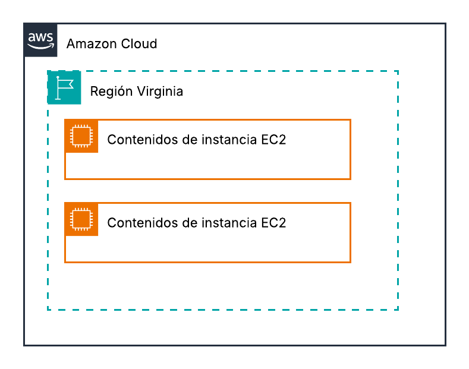

# Exercici 1 Pt1.3 - Cloud Computing

## Topologia de Xarxa
Primer he creat la topologia de xarxa on tenim:
- Una VPC en una regió
- Tres subxarxes (subnets)
- 2 instàncies EC2 a cada subnet



# Exercici 1

## TERRAFORM


En aquest exercici creem 2 instàncies EC2 amb les següents característiques:

```hcl
provider "aws" {
    region = "us-east-1"    # Regió on es creen els recursos
}

resource "aws_instance" "ec2_instance_1" {
  ami           = "ami-0c02fb55956c7d316"  # "software de la instància "Amazon Linux 2023
  instance_type = "t3.micro"               # Tipus d'instància
  tags = {
    Name = "ec2-instance-1"                # Nom a la consola AWS
  }
}


