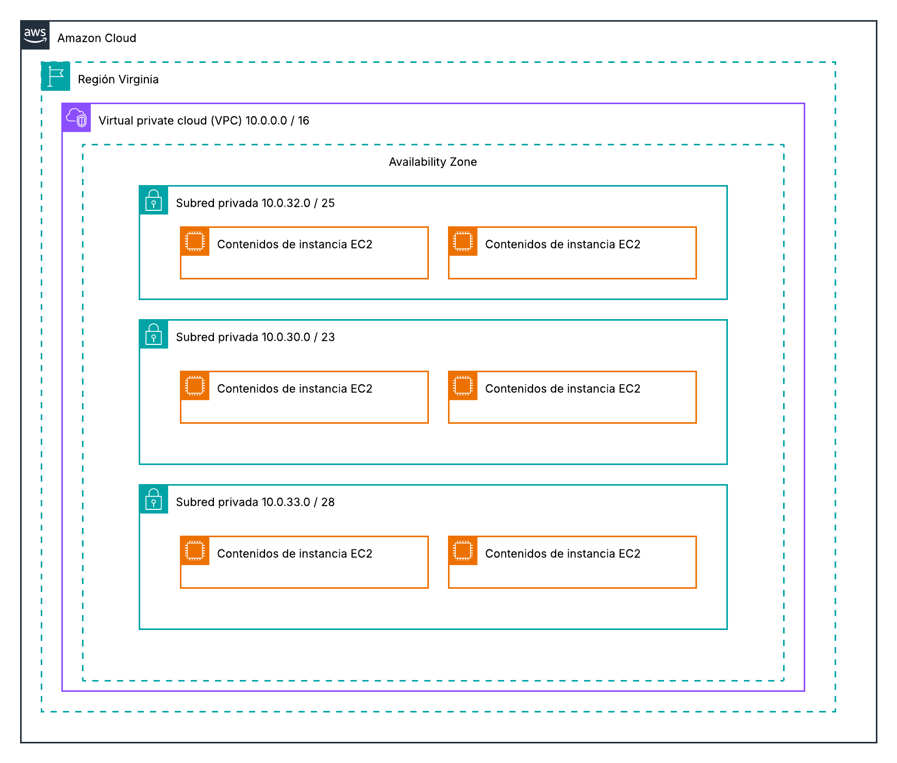
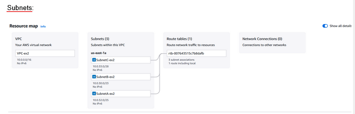
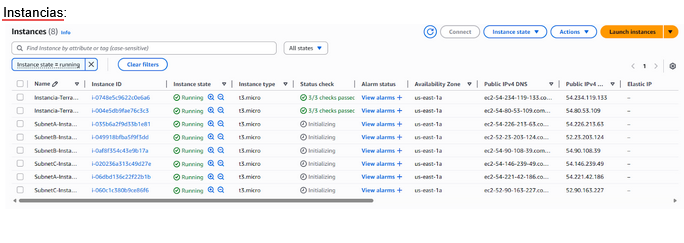

# Exercici 1 Pt1.3 - Cloud Computing

## Topologia de Xarxa
Primer he creat la topologia de xarxa on tenim:
- Una VPC en una regió
- Tres subxarxes (subnets)
- 2 instàncies EC2 a cada subnet

# Exercici 2

## AWS
Captures finals de las subnets i instancias:
    -3 subreds
    -2 EC2 en cada subred
    

## TERRAFORM

Primer bloc (aws_vpc)

He creat una VPC (Virtual Private Cloud), que és una xarxa virtual on es poden connectar diferents recursos com servidors o bases de dades.

Li he definit el rang d’adreces IP 10.0.0.0/16, que marca l’espai total d’IP de la xarxa.

Li he afegit una etiqueta amb el nom pt1-3-ex2-vpc per identificar-la a la consola d’AWS.

Segon bloc (aws_subnet)

He creat una subxarxa dins de la VPC anterior.

He indicat que pertany a la VPC amb el camp vpc_id = aws_vpc.vpc.id.

Li he assignat el rang d’IP 10.0.32.0/25.

L’he situat a la zona de disponibilitat us-east-1a.

Li he afegit una etiqueta amb el nom subnet-A per reconèixer-la més fàcilment.

