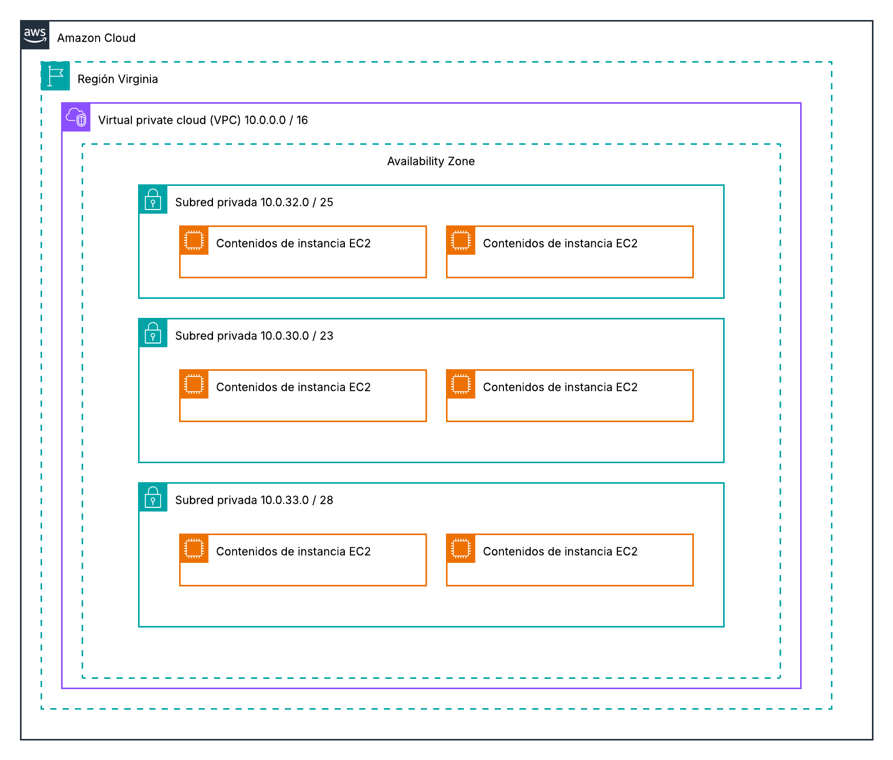

# Exercici 1 Pt1.3 - Cloud Computing

## Topologia de Xarxa
Primer he creat la topologia de xarxa on tenim:
- Una VPC en una regió
- Tres subxarxes (subnets)
- 2 instàncies EC2 a cada subnet

## Exercici 2

